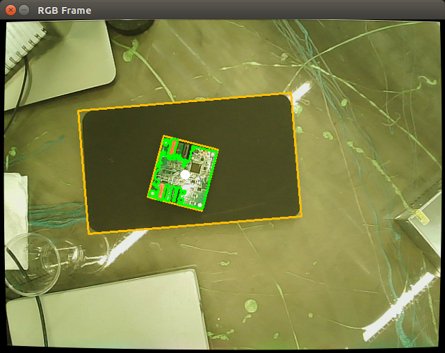

# board_detection

## Overview

Detects board pictured below using OpenCV. Outputs static transform for position and orientation.

ROS Version: melodic

#### Dependencies

- [Robot Operating System (ROS)](http://wiki.ros.org) (middleware for robotics),

#### Building

To build from source, clone the latest version from this repository into your catkin workspace and compile the package using

	cd catkin_workspace/src
	git clone TBD.git
	rosdep install --from-paths . --ignore-src
	catkin_make

## Usage

     $ roslaunch astra_launch astrapro.launch
     $ roslaunch board_detection board_detection.launch

## Launch files

* **board_detection.launch** 

## Nodes

### detect_board

#### Published Topics

* **`/tf_static`** ([tf2_msgs/TFMessage])

#### Subscribed Topics

* **`/camera/rgb/image_rect_color`** ([sensor_msgs/Image])

* **`/camera/depth/points`** ([sensor_msgs/PointCloud2])

## Known Issues
- Slight offset may exist on output tf
- May need to improve filtering for varied lighting conditions